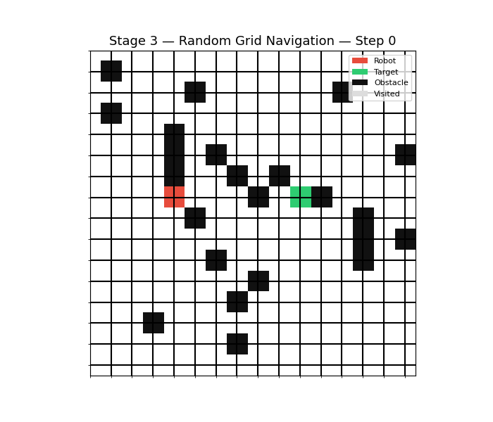
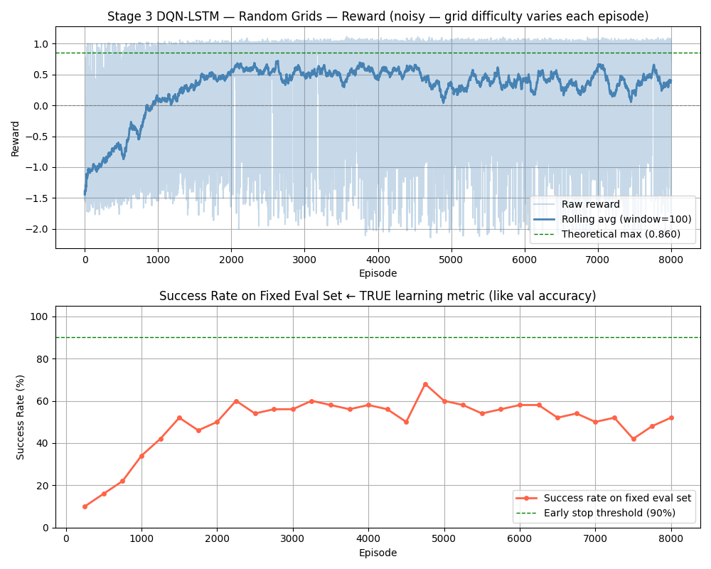

# GridNav-AI 🤖🗺️


A robot navigation project exploring two fundamentally different approaches to the same problem — **Supervised Learning** (ResNet CNN imitating BFS) and **Reinforcement Learning** (DQN-LSTM learning through trial and error).

---

## Demo

### Supervised Learning (ResNet)


### Reinforcement Learning (DQN-LSTM)


---

## Two Approaches, One Problem

| | Supervised (ResNet) | Reinforcement (DQN-LSTM) |
|---|---|---|
| **How it learns** | Imitates BFS optimal paths | Trial and error with rewards |
| **Needs labels?** | ✅ Yes — BFS solutions | ❌ No |
| **State input** | Full grid (3-channel tensor) | 5×5 vision window |
| **Actions** | 8 directions | 4 directions |
| **Architecture** | ResNet CNN | DQN-LSTM |
| **Generalization** | Any grid same size | ✅ Random grids, variable density |
| **Training time** | ~10-15 min | ~30-60 min |

---

## How Each Approach Works

### Supervised Learning Pipeline
1. **Random Grid Generation** — generates grids with obstacles, robot `R`, and target `T`
2. **BFS Optimal Pathfinding** — finds shortest path (used as training labels)
3. **Dataset Creation** — each BFS step becomes a `(state, action)` training pair
4. **ResNet Training** — CNN learns to predict next optimal move from grid state
5. **Simulation** — trained model navigates new unseen grids

### Reinforcement Learning Pipeline
1. **Random Grid Generation** — new random grid every episode, variable obstacle density
2. **DQN-LSTM Agent** — 5×5 vision window, hidden state carries memory between steps
3. **Reward Shaping** — warm/cold signal toward target + revisit penalty
4. **Fixed Eval Set** — 20 fixed grids measure true generalization (like validation set)
5. **Early Stopping** — stops when 90% success rate achieved on eval set

---

## Model Architectures

### ResNet CNN (Supervised)
```
Input (3 channels):
├── Channel 0: Obstacle map
├── Channel 1: Robot position
└── Channel 2: Target position
        ↓
Initial Conv2D (32 filters) + BN + ReLU
        ↓
Residual Block 1 (32 → 32)
        ↓
Residual Block 2 (32 → 128, with 1×1 downsample)
        ↓
Flatten → Dropout(0.6) → FC(128) → Dropout(0.6) → FC(8)
        ↓
Output: 8 actions (UP, DOWN, LEFT, RIGHT, diagonals)
```

### DQN-LSTM (Reinforcement)
```
Input (30 values):
├── 5×5 vision window (25 values)
│     0.0=free, 0.5=OOB, 1.0=obstacle, 3.0=target
├── Normalized robot position (2 values)
├── Normalized target position (2 values)
└── Exploration progress (1 value)
        ↓
Encoder: Linear(30→128) → LayerNorm → ReLU → Linear(128→128) → LayerNorm → ReLU
        ↓
LSTM(128→128) — carries memory (h,c) between steps
        ↓
Decoder: Linear(128→64) → ReLU → Linear(64→4)
        ↓
Output: 4 Q-values (UP, DOWN, LEFT, RIGHT)
```

---

## Training Results

### Supervised Learning


| Metric | Value |
|--------|-------|
| Training Samples | 5,000 |
| Grid Size | 15×15 |
| Obstacle Density | 25% |
| Epochs | 50 (early stopping) |
| Optimizer | Adam (lr=5e-4, wd=5e-3) |
| Loss | CrossEntropyLoss |

### Reinforcement Learning


| Metric | Value |
|--------|-------|
| Grid Size | 15×15 |
| Obstacle Density | 10%–35% (random each episode) |
| Episodes | 5000–8000 |
| Optimizer | Adam (lr=1e-3, wd=1e-4) |
| Eval Set | 20 fixed grids |
| Best Success Rate | ~70% on unseen random grids |

---

## Project Structure

```
GridNav-AI/
├── README.md
├── requirements.txt
│
├── src/
│   ├── path_finder.py              # Supervised ResNet training + simulation
│   ├── reinforcement_lesson_2.py   # Q-Table (fixed grid)
│   ├── reinforcement_lesson_3.py   # DQN (position + target)
│   ├── reinforcement_lesson_4.py   # DQN blind robot (reward shaping)
│   ├── reinforcement_lesson_5.py   # DQN-LSTM (5×5 vision, random grids) ← main RL
│   └── reinforcement_lesson_6.py   # BPTT (sequence training, experimental)
│
├── demo/
│   ├── app.py                      # Streamlit home page
│   ├── core/
│   │   ├── grid_utils.py           # Shared grid generation + rendering
│   │   ├── rl_model.py             # DQN-LSTM inference + training
│   │   └── supervised_model.py     # ResNet inference + training
│   └── pages/
│       ├── 1_Training.py           # Live training (RL + Supervised)
│       ├── 2_Inference.py          # Side-by-side model comparison
│       └── 3_Grid_Builder.py       # Draw custom grids, benchmark models
│
├── models/
│   ├── stage3_best.pth             # Best RL model
│   └── supervised_best.pth         # Best supervised model
│
├── examples/
│   ├── robot_animation.gif
│   ├── stage3_animation.gif
│   ├── training_history.png
│   └── stage3_rewards.png
│
└── .gitignore
```

---

## Requirements

```bash
pip install -r requirements.txt
```

```
torch>=2.0.0
numpy>=1.24.0
matplotlib>=3.7.0
tqdm>=4.65.0
pillow>=9.0.0
streamlit>=1.28.0
plotly>=5.17.0
```

---

## Setup & Run

### Clone
```bash
git clone https://github.com/WeskerPRO/GridNav-AI.git
cd GridNav-AI
```

### Train Supervised (ResNet)
```bash
cd src
python path_finder.py
```

### Train Reinforcement (DQN-LSTM)
```bash
cd src
python reinforcement_lesson_5.py
```

### Run Streamlit Demo
```bash
cd demo
streamlit run app.py
```

The demo has three pages:
- **Training** — watch RL agent or ResNet train live with real-time curves
- **Inference** — load trained models, compare RL vs Supervised side by side
- **Grid Builder** — draw your own maze, benchmark all models + BFS

---

## RL Training Notes

> 💡 Per-episode reward oscillates on random grids — this is expected. Grid difficulty varies each episode. Use **success rate on the fixed eval set** as the true learning metric (equivalent to validation accuracy).

> ⚠️ Train on the same grid size you test on. RL model normalizes positions by grid dimensions — a model trained on 15×15 expects 15×15 inputs.

> 🧠 The model needs the target coordinates in its state to generalize across random grids. Without them, reward shaping sends contradictory signals on different grid layouts.

---

## Roadmap

### ✅ Completed
- ✅ Random grid generator with guaranteed solvable paths
- ✅ BFS optimal pathfinding for label generation
- ✅ ResNet CNN with residual blocks + Dropout regularization
- ✅ Training with early stopping + LR scheduler
- ✅ Q-Table navigation (fixed grid)
- ✅ DQN with position + target coordinates
- ✅ DQN blind robot with reward shaping
- ✅ DQN-LSTM with 5×5 vision window
- ✅ Random grid training for generalization
- ✅ Fixed eval set (validation equivalent for RL)
- ✅ Streamlit demo with live training + inference + grid builder
- ✅ BPTT sequence training (experimental)

### 🚧 In Progress
- 🔄 Model generalization improvement (target: 80%+ success rate)

### 📋 Upcoming
- [ ] 3D grid pathfinding (supervised + RL)
- [ ] Fog of war exploration (partial map reveal)
- [ ] Larger grid support (35×35+)

---

## License

[](https://opensource.org/licenses/MIT)

This project is licensed under the **MIT License** — free to use, modify, and distribute.

---

<div align="center">

Made with ❤️ by [WeskerPRO](https://github.com/WeskerPRO)

*Supervised Learning meets Reinforcement Learning — same robot, two minds.*

</div>
