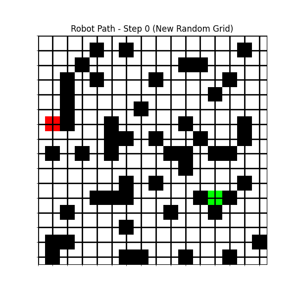
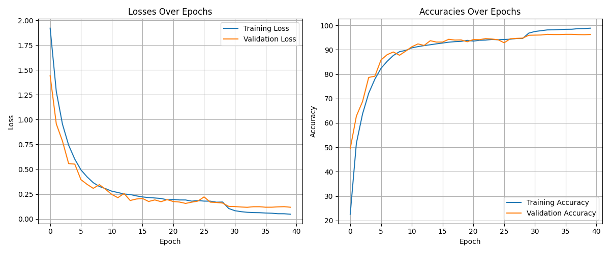

# ResNet Grid Pathfinder 🤖🗺️


A deep learning project where a **ResNet-based CNN** learns to navigate a robot from a start position to a target on a randomly generated grid — while avoiding obstacles.

---

## Demo


---

## How It Works

### Pipeline:
1. **Random Grid Generation** — generates thousands of grids with obstacles, robot `R`, and target `T`
2. **BFS Optimal Pathfinding** — finds the shortest path on each grid (used as training labels)
3. **Dataset Creation** — each step in the optimal path becomes a `(state, action)` training pair
4. **ResNet Training** — CNN learns to predict the next optimal move from the current grid state
5. **Simulation & Animation** — trained model navigates a new unseen grid live

---

## Model Architecture
```
Input (3 channels):
├── Channel 1: Obstacle map
├── Channel 2: Robot position
└── Channel 3: Target position
        ↓
Initial Conv2D (32 filters)
        ↓
Residual Block 1 (32 → 32)
        ↓
Residual Block 2 (32 → 128)
        ↓
Flatten → Dropout → FC(128) → Dropout → FC(8 actions)
        ↓
Output: 8 possible moves
(UP, DOWN, LEFT, RIGHT, TOP-LEFT, TOP-RIGHT, BOTTOM-LEFT, BOTTOM-RIGHT)
```

---

## Training Results



| Metric | Value |
|--------|-------|
| Training Maps | 5,000 |
| Grid Size | 15x15 |
| Obstacle Density | 25% |
| Epochs | 50 (early stopping) |
| Optimizer | Adam |
| Loss | CrossEntropyLoss |

---

## Project Structure
```
ResNet-Grid-Pathfinder/
├── README.md
├── requirements.txt
├── src/
│   └── pathfinder.py       # Main training + simulation script
├── notebooks/
│   └── demo.ipynb          # Interactive demo
├── examples/
│   ├── robot_animation.gif # Robot navigating live
│   └── training_curves.png # Loss & accuracy graphs
└── .gitignore
```

---

## Requirements

- Python 3.12+
- Dependencies:
```bash
pip install -r requirements.txt
```

---

## Setup & Run

### 1. Clone the repository
```bash
git clone https://github.com/WeskerPRO/GridNav-AI.git
cd GridNav-AI
```

### 2. Install dependencies
```bash
pip install -r requirements.txt
```

### 3. Train the model
```bash
cd src
python pathfinder.py
```

### 4. Output
- Training loss & accuracy curves will be displayed
- Robot navigation animation will play on a new random grid
- Best model saved as `path_prediction_mlp.pth`

---

## Notes
> ⚠️ Trained model weights (`.pth`) are not included due to file size.
> Run `pathfinder.py` to train from scratch — takes ~10-15 minutes depending on your hardware.

> 💡 GPU is automatically used if available (`CUDA`). CPU works fine too.

---

## Roadmap

### ✅ Completed
- ✅ Random grid generator with guaranteed solvable paths
- ✅ BFS optimal pathfinding for label generation
- ✅ ResNet CNN architecture with residual blocks
- ✅ Training with early stopping + LR scheduler
- ✅ Live robot navigation animation

### 🚧 Upcoming
- [ ] Reinforcement Learning version (Q-Learning / DQN)
- [ ] Larger and more complex grid support
- [ ] Web demo (Streamlit or Gradio)
- [ ] 3D grid pathfinding

---

## License
MIT